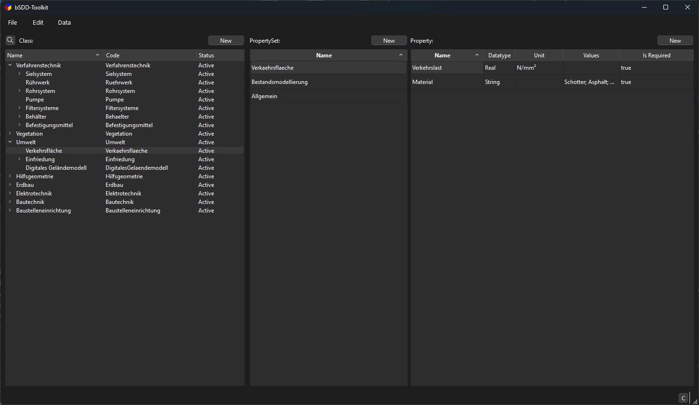
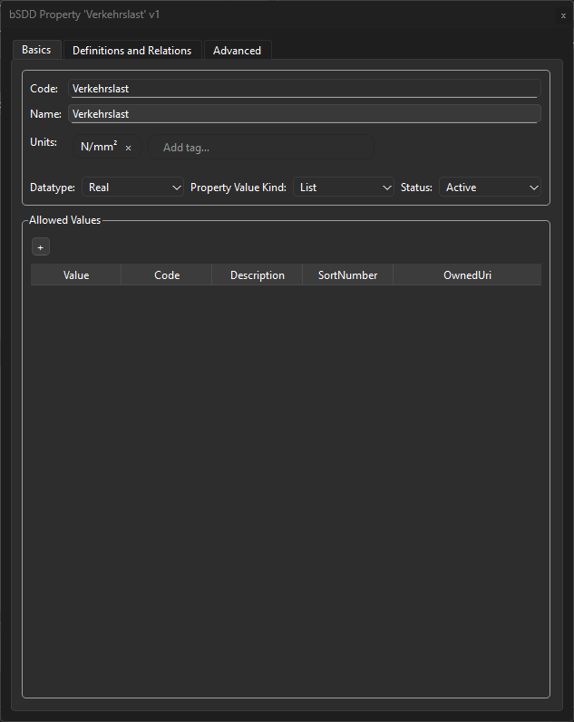
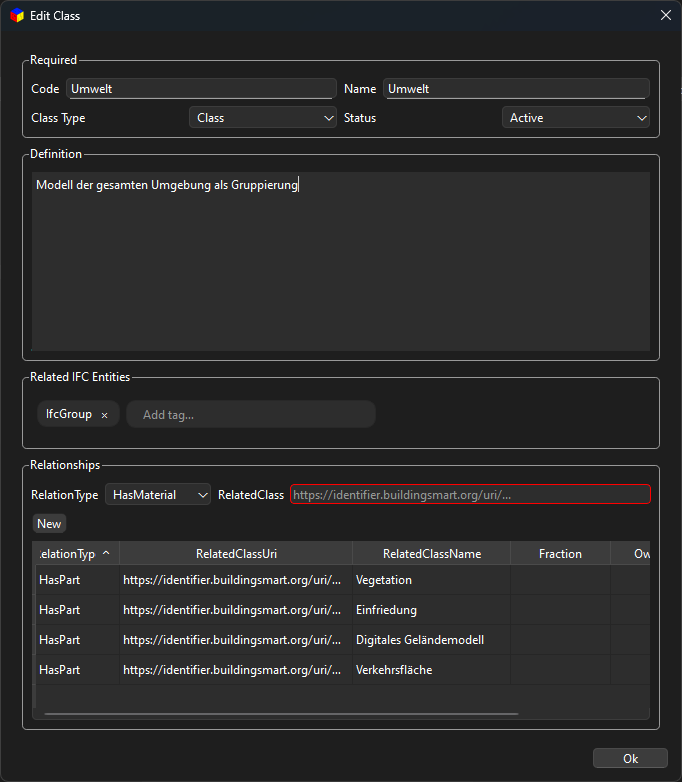

# bSDD-Toolkit

Visual editor and Python toolkit for working with buildingSMART Data Dictionary (bSDD) JSON.

This repository contains:
- A validated data model for bSDD JSON (Pydantic v2) under `src/bsdd_json`.
- A PySide6 GUI to create, view, and edit bSDD dictionaries under `src/bsdd_gui`.


## Features
- Edit dictionaries: classes, property sets, properties, and allowed values.
- Class tree with drag & drop and quick search.
- Property set and property tables with sorting and inline editing where supported.
- Relationship and IFC helpers (modules present for extension).
- Modular architecture with a lightweight plugin system.
- Multilingual-ready UI (German translation scaffold included).


## Requirements
- Python 3.10+
- Pip and a virtual environment are recommended
- Platform dependencies for Qt (PySide6) as required by your OS


## Installation

Clone the repository and install the package (editable for development or standard install):

```bash
git clone https://github.com/<your-org-or-user>/bsdd-creator.git
cd bsdd-creator

# (optional) create and activate a virtualenv
python -m venv .venv
# Windows
.\.venv\Scripts\activate
# macOS/Linux
source .venv/bin/activate

# install
pip install -U pip
pip install -e .            # for development
# or
pip install .               # for a regular install

# dev extras
pip install -e .[dev]       # ruff, black, mypy, pytest, etc.
```


## Run the GUI

Run the application module directly (optionally pass a path to a bSDD JSON file to open):

```bash
python -m bsdd_gui                   # start empty
python -m bsdd_gui som-0.2.0.json    # open example dictionary
```

Command-line options supported by the launcher:

```text
python -m bsdd_gui [open_path] [-l LOG_LEVEL] [--open_last_project]

open_path           Optional path to a bSDD JSON file
-l, --log-level     Integer log level (e.g. 10=DEBUG, 20=INFO)
--open_last_project Open the last project on startup
```


## Screenshots

Add the PNGs to `docs/images/` with the names below. They will render automatically in GitHub once added.

### Main Window


### Editors
| Edit Properties | Edit Classes |
| --- | --- |
|  |  |

### Graph View


## Use the Data Model (Python)

Load, inspect, and write bSDD JSON using the Pydantic models:

```python
from bsdd_json import BsddDictionary, BsddClass, BsddProperty, BsddClassProperty

# Load and validate an existing dictionary (see som-0.2.0.json)
d = BsddDictionary.load("example.json")
print(d.DictionaryName, d.DictionaryVersion)

# Programmatically create a new dictionary
new_d = BsddDictionary(
    OrganizationCode="example",
    DictionaryCode="demo",
    DictionaryName="Demo Dictionary",
    DictionaryVersion="0.1.0",
    LanguageIsoCode="en-US",
    LanguageOnly=False,
    UseOwnUri=False)
# Create and add Classes
class_1 = BsddClass(Code="Wall", Name="Wall", ClassType="Class")
class_2 = BsddClass(Code="Slab", Name="Slab", ClassType="Class")
new_d.Classes += [class_1, class_2]

# Create and add Property
prop_1 = BsddProperty(Code="Height", Name="Height", DataType="Real")
new_d.Properties.append(prop_1)

# Create and add ClassProperties
class_1.ClassProperties.append(
    BsddClassProperty(Code="height", PropertyCode=prop_1.Code, PropertySet="Geometry")
)
class_2.ClassProperties.append(
    BsddClassProperty(Code="height", PropertyCode=prop_1.Code, PropertySet="Geometry")
)

# Serialize to JSON
new_d.save("example.json")
```


## Project Structure

- `src/bsdd_json` — Pydantic models and helpers for bSDD JSON.
- `src/bsdd_gui` — PySide6 GUI application (run with `python -m bsdd_gui`).
  - `__main__.py` — entry point for the GUI launcher.
  - `module/` — feature modules (class tree, property tables, search, etc.).
  - `core/` — application wiring and shared UI logic.
  - `tool/` — helper functions that get called from /core.
  - `resources/` — icons, translations, and static assets.


## Development

Useful commands when developing locally:

```bash
# formatting & linting
ruff check .
black .

# type checking
mypy src

# run the GUI during development
python -m bsdd_gui
```

## Build Your Own GUI

There are two typical ways to “build your own GUI” with this project:

1) Package this app as a standalone executable (no Python required for end users)
2) Extend the GUI with your own modules/widgets

### 1) Package a Standalone App (PyInstaller)

Prerequisites:

- Python 3.10+
- A virtual environment with the project installed
- PyInstaller installed: `pip install pyinstaller`

Build (Windows, PowerShell):

```powershell
# from the repo root
python -m venv .venv
.\.venv\Scripts\Activate.ps1
pip install -U pip
pip install .
pip install pyinstaller

# run the build from src/ so relative paths in the spec resolve
cd src
pyinstaller main.spec -y
```

Artifacts:

- Windows: `src/dist/BSDD-Toolkit/BSDD-Toolkit.exe`
- macOS/Linux: `src/dist/BSDD-Toolkit/` binary in the same folder

Notes:

- The spec (`src/main.spec`) bundles resources and sets the app name and icon.
- To hide the console window, change `console=True` to `False` in `src/main.spec` and rebuild. On Windows you can toggle the console using the UI
- VS Code users can also run the `Build` launch config, which executes `src/build.ps1`.

### 2) Extend the GUI (Create a Module)

Scaffold a new module that plugs into the app:

```bash
# from the repo root
python src/bsdd_gui/_add_module.py my_feature
```

This generates files under:

- `src/bsdd_gui/core/my_feature.py` – core hooks/logic
- `src/bsdd_gui/tool/my_feature.py` – convenience accessors to properties/state
- `src/bsdd_gui/module/my_feature/` – UI, triggers, and properties

One manual step is required: expose the new tool in
`src/bsdd_gui/tool/__init__.py` by adding an import line, e.g.

```python
from .my_feature import MyFeature
```

UI workflow (optional):

- Design Qt forms with Qt Designer and save `.ui` files under
  `src/bsdd_gui/module/my_feature/qt/`.
- Compile them to Python with `pyside6-uic`, for example:

  ```bash
  pyside6-uic src/bsdd_gui/module/my_feature/qt/Widget.ui \
    -o src/bsdd_gui/module/my_feature/qt/ui_Widget.py
  ```

Run and iterate:

```bash
python -m bsdd_gui -l 10
```

Tip: Look at existing modules in `src/bsdd_gui/module/` (for example,
`class_editor_widget` or `main_window_widget`) as reference implementations
for wiring `ui.py`, `trigger.py`, `core/*.py` and `tool/*.py` together.

## License

MIT — see `LICENSE` for details.


## Acknowledgements

- buildingSMART International for the bSDD initiative and specifications.
